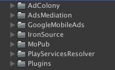

# UnityAdsMediation  

**AdMob** 
**AdColony**  

Import **Unity Package** to existing or to a new Project  
 
These folders should be at **Assets** or **Root Folder**  

 
The platform target should be **Android**  

 
Inside Assets Menu, locate **Play Services Resolver -> Android Resolver -> Resolve**  

 
Message when **Resolved**  

 
Time to add **AdMob** Android **App ID** 
Locate to **Assets Menu -> Google Mobile Ads -> Setting**  

 
Check **Google Ad Mob** - **Enabled** 
Add **AdMob Android App Id** string  

 
Locate Prefab at **AdMediation** -> **Prefabs** Folder  

 
Into a Scene add the **AdsManager** Prefab 
The Hierarchy should be like the Image  

 
Select Prefab's GameObject in the Scene **AdMediation** and add **AdMob** strings  

 
Add **Ad Units** to **MoPubManager**   

 
Add **Interstitial Ad Units** and **Rewarded Ad Units** to **MoPubDemoScene**   

 
Inside **IronSource** GameObject, Add **Unique User Id** and **AppKey**   

 
 
**AdsManager** Prefab GameObject include an Script **AdsManager** 
This **Script** includes methods to show Interstitila Ads and Rewarded Ads  

 
These methods could be called within a Click or from other Script Component  

 
**AdsManager** exposes callbacks from the Ads State  
